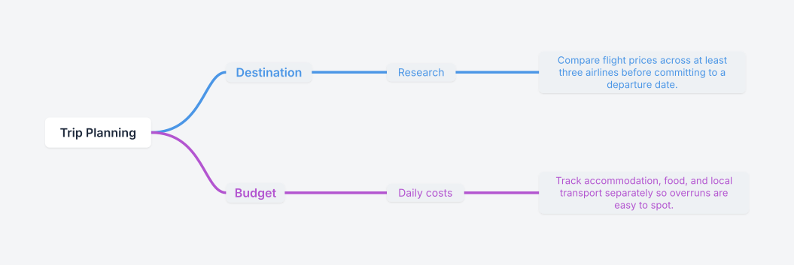

# mindmaply

[](https://github.com/productscalexyz/mindmaply/actions/workflows/ci.yml)
[](./LICENSE)

Render Mermaid flowcharts and Markdown outlines as beautiful, Whimsical-quality SVG mind maps.

You write standard [Mermaid flowchart](https://mermaid.js.org/syntax/flowchart.html) syntax — or just Markdown headings and bullets — and mindmaply applies an opinionated visual layer: a curated color palette, clean typography, and two polished layout engines (orthogonal and curved).

**Try it live at [mindmaply.app](https://mindmaply.app)** · [Syntax docs](https://mindmaply.app/#/docs)

## Example

This Markdown outline:

```markdown
# Trip Planning
## Destination
### Research
- Compare flight prices across at least three airlines before committing to a departure date.
## Budget
### Daily costs
- Track accommodation, food, and local transport separately so overruns are easy to spot.
```

renders to this mind map (long labels auto-wrap, deeper levels scale down, every node gets a card):

[](https://mindmaply.app/#/editor?d=N4IgbiBcCMA0IGcD2BXATgYwKZRAYgAIAVNASwAcCAFAGwEMA7B0hgcwB0G9CARLBAC4s6QpA07dCAJX5Y6mABacAtAQDCSALbl5WAgDMapVgoEFyZbAgJ0MaJAmsiCNOYIICFaLHrqk0Rgz8BABGWPpI3gQYWpqkAkJsHkg2BAAmWDpoAuh6aSJYAHQShABCKGmsWAIlvH40AJ7RDgIIKsRotgDWNhgxmppI+aIMsAZIQ2OMaS5IGHQ0Hp0MCOSRZgiZ8gWNBMgESGBYaGgoKzZRbk0CKatIAoUg8BFomiK4b2hdaUgA7gxPEBpfxYDAjXAAGSkgKwlSwAGUBA1XLgMOgjmkQABfIA)

The image above is generated by `mindmaply-core` itself — click it to open the same document in the live editor.

## What's in this repo

A pnpm monorepo with a clean split between the **rendering engine** and the **web app**:

| Path | What it is |
| --- | --- |
| [`packages/core`](./packages/core) | **`mindmaply-core`** — the framework-agnostic rendering engine (npm-publishable, not yet published). Parser → tree → layout → SVG. One runtime dependency (`d3-hierarchy`). No DOM, no React. |
| [`apps/editor`](./apps/editor) | The web app at mindmaply.app — a React frontend (landing page, live editor, and docs) that consumes `mindmaply-core`. Format switching (Mermaid ⇄ Markdown), sharing, zoom/pan. |

The engine knows nothing about the app; the app depends on the engine via the workspace. You can use `mindmaply-core` standalone in any JS/TS project.

## Use the library

```bash
npm i mindmaply-core
```

Or straight from this repo via the workspace (`pnpm install && pnpm --filter mindmaply-core build`).

```ts
import { render, renderMarkdown } from 'mindmaply-core'

const svg = render(`flowchart LR
  root((Topic)) --> A[Idea A]
  root --> B[Idea B]
  style root fill:#FFFFFF,stroke:#1E293B
  style A fill:#4B96E633,stroke:#4B96E6
  style B fill:#B355D033,stroke:#B355D0`)

// or from a Markdown outline
const svg2 = renderMarkdown(`# Topic
- Idea A
- Idea B`)
```

Full API in the [core package README](./packages/core/README.md).

There is also a CLI:

```bash
printf '# Plan\n- research\n- build\n' | npx -y mindmaply-core render -o plan.svg
```

## Use with AI agents

This repo ships an [Agent Skill](https://agentskills.io) that teaches AI
assistants to create, validate, render, and share mind maps with
`mindmaply-core`. One command installs it into every SKILL.md-compatible agent
detected on your machine (Claude Code, Codex, Cursor, Windsurf, Copilot,
Gemini, and more):

```bash
npx skills add productscalexyz/mindmaply
```

Or install manually by copying [`skills/mindmaply`](./skills/mindmaply) into
your agent's skills directory: `.claude/skills/` (Claude Code),
`~/.agents/skills/` (Codex), `.cursor/skills/` (Cursor), `.github/skills/`
(Copilot). For claude.ai, zip the `skills/mindmaply` folder and upload it under
Settings > Skills. No build step is needed; the skill drives the published npm
package via `npx`.

## Develop

Requirements: Node ≥ 18, [pnpm](https://pnpm.io) 9.

```bash
pnpm install
pnpm dev      # editor app at http://localhost:5173
pnpm test     # core + editor test suites
pnpm build    # production build of the editor
```

## Contributing

Contributions are very welcome — see [CONTRIBUTING.md](./CONTRIBUTING.md) for the workflow (TDD, Conventional Commits, changesets for releases) and look for [`good first issue`](https://github.com/productscalexyz/mindmaply/labels/good%20first%20issue) labels.

## License

[MIT](./LICENSE)
